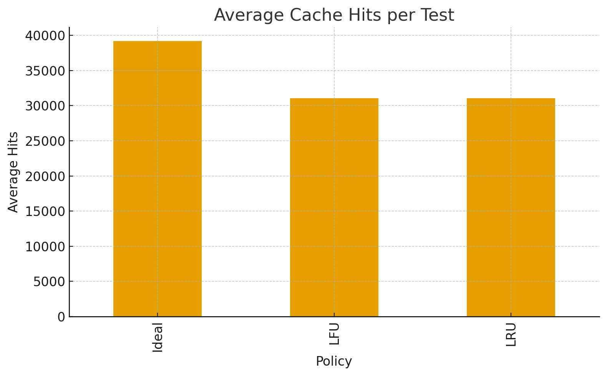
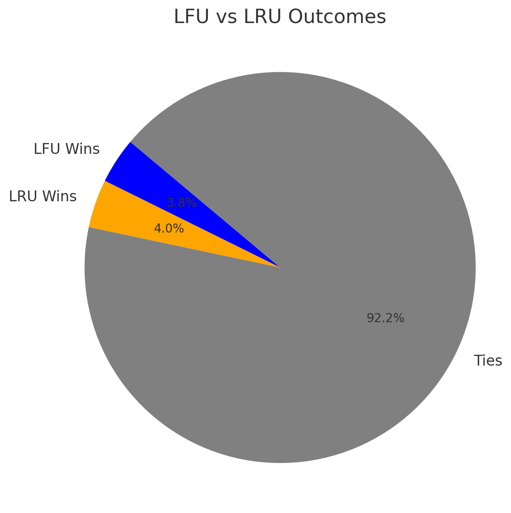

# Cache

Realisation of the cache in three algorithms: 
- LRU (Least recently used)
- LFU (Least frequently used)
- Ideal (Belady's optimal algorithm)

## Comparing cache perfomance

Overall results:



Comparing LFU vs LRU:



## Dependencies

Compiler c/c++(clang preferable), cmake, python, gtest

```shell
apt-get install build-essential clang ninja-build make cmake python3
apt-get install libgtest-dev libgmock-dev libtbb-dev
```

## Building

### Config

*Debug:*
```shell
cmake -G Ninja -DCMAKE_BUILD_TYPE=Debug -DCMAKE_EXPORT_COMPILE_COMMANDS=ON -DCMAKE_CXX_COMPILER=clang++ -S . -B build
```
*Release:*
```shell
cmake -G Ninja -DCMAKE_BUILD_TYPE=Release -DCMAKE_CXX_COMPILER=clang++ -S . -B build
```

### Build
```
cmake --build build
```

Binaries are located in `build/bin/cache_*`

## Tests

Sources of tests are located in `tests/` and script for generating random tests and run caches on it in `tests/gen_tests.py`.

```shell
python3 ./tests/gen_tests.py --outdir data_test --tests 1000 --bin-dir build/bin --key-dir keys
```

Google Tests, for run do:

```shell
ctest --test-dir build/tests --output-on-failure
```

## Workflow

Pipeline runs in 2 stages:
- `build`: debug build project & create artifact.
- `tests`: run tests for build